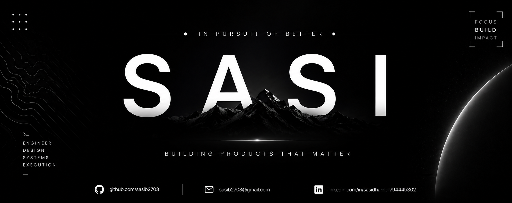

  

  

---

<h1 align="center">Sasidhar Borra</h1>

<h3 align="center">In Pursuit of Better</h3>

---

# ⚡ Philosophy

> Great products are built with clarity.  
> Great systems are built with discipline.  
> Excellence is earned through consistency.

---

# 🚀 Current Focus

- Full Stack Development  
- Problem Solving  
- Building Real Projects  
- Improving Every Day  

---

# 🧠 Right Now

Early in the journey.

Focused on growth.

Committed to building better.

---

# 🛠 Tech Stack

  

---

# 🚀 Featured Projects

### Onboard Hub  
AI-powered onboarding platform for structured employee onboarding.

---

### Cognixa  
Rethinking learning through realistic simulations.

---

### Smart Budget Manager  
Personal finance tracking system.

---

# 📊 GitHub Analytics

  
  

  

---

# 🌐 Connect

📧 Email: sasib2703@gmail.com  

💼 LinkedIn: www.linkedin.com/in/sasidhar-b-79444b302  

🌐 Portfolio: Coming Soon  

---

  <h3 align="center">Discipline builds what motivation cannot.</h3>

